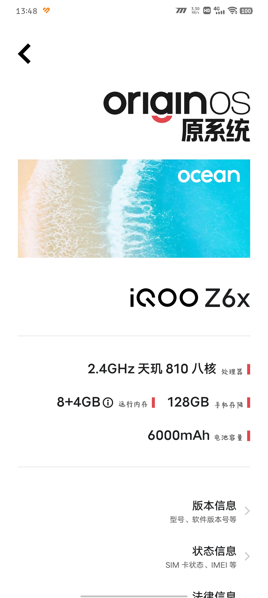
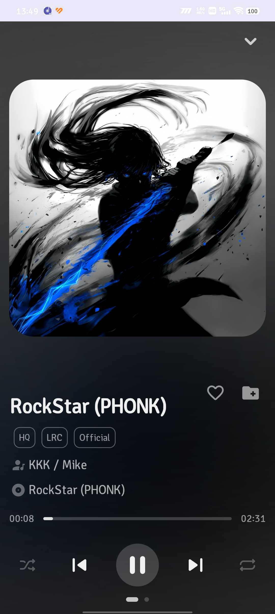
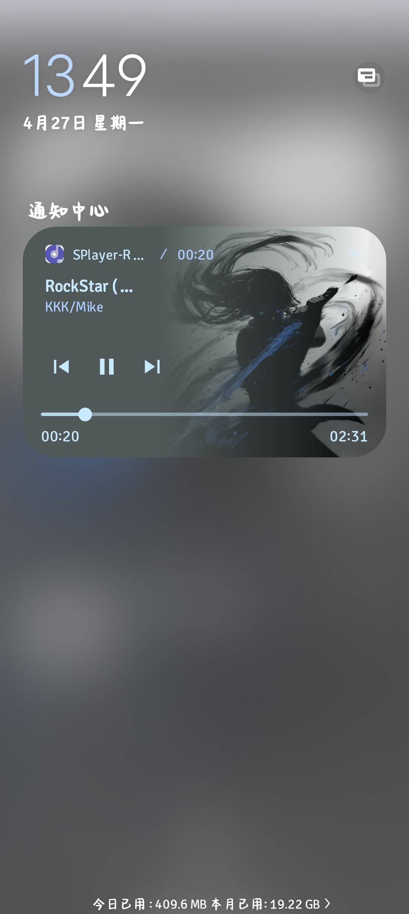
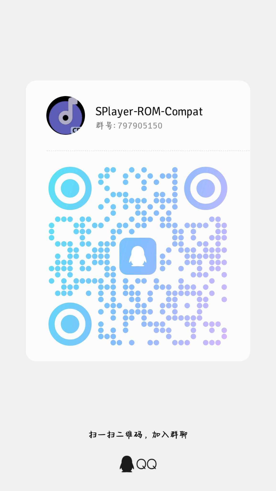

# SPlayer-ROM-Compat

<p align="center">
  
</p>

<p align="center">
  
  
  
  
  
  
</p>

> SPlayer-ROM-Compat 是基于 SPlayer Android 化迁移的 ROM 兼容版。Compat 是“兼容”的缩写，项目目标是在 Android 与 HarmonyOS 等国内定制系统中稳定运行，并与各类 ROM 的音频、通知、后台策略“和谐共生”。

---

## 界面预览

<table>
<tr>
  <td align="center"><b>手机设置</b></td>
  <td align="center"><b>手机主页</b></td>
  <td align="center"><b>播放页</b></td>
  <td align="center"><b>ROM 原生音频控制卡片</b></td>
</tr>
<tr>
  <td></td>
  <td></td>
  <td></td>
  <td></td>
</tr>
</table>

---

## 特性一览

| 分类         | 描述                                                                                                |
| ------------ | --------------------------------------------------------------------------------------------------- |
| 原生播放引擎 | Android 端使用 `AndroidNativeAudioPlayer`，不再依赖 `HTMLAudioElement` 播放音频。                   |
| 原生媒体控制 | 接入 Android `MediaSession` 与系统音频控制卡片，支持播放、暂停、上一首、下一首。                    |
| ROM 兼容     | 面向 HyperOS / MIUI / HarmonyOS / EMUI / MagicOS / ColorOS / OriginOS 等国内 ROM 做后台与通知适配。 |
| 本地 API     | Android 端集成本地 API 服务，减少对宿主机环境依赖。                                                 |
| 自适应 UI    | 针对手机、平板、虚拟机分辨率继续优化列表、播放页、设置页和安全区域。                                |
| 分架构打包   | 支持 `arm64-v8a`、`armeabi-v7a`、`x86_64` 独立 APK，方便测试用户按设备架构安装。                    |
| CI 发布      | GitHub Actions 可自动解码 keystore 并构建签名 Release APK。                                         |
| 独立包名     | Android `applicationId` 使用 `top.imsyy.splayer.romcompat`，可与 SPlayer-For-Android 共存安装。     |

---

## 下载与安装

优先选择 `arm64-v8a`，绝大多数现代 Android / HarmonyOS 手机都适用。

|      ABI      | 适用设备                               | 推荐度 |
| :-----------: | -------------------------------------- | :----: |
|  `arm64-v8a`  | 现代 Android / HarmonyOS 手机、平板    |   高   |
| `armeabi-v7a` | 旧款 32 位 ARM 设备                    |   中   |
|   `x86_64`    | Android Studio 模拟器、部分 Intel 设备 | 测试用 |

本地构建后的 Release APK 位于：

- `android/dist/apk/release/SPlayer-ROM-Compat-v3.0.0-rc.3-Beta8-arm64-v8a-release.apk`
- `android/dist/apk/release/SPlayer-ROM-Compat-v3.0.0-rc.3-Beta8-armeabi-v7a-release.apk`
- `android/dist/apk/release/SPlayer-ROM-Compat-v3.0.0-rc.3-Beta8-x86_64-release.apk`

---

## v3.0.0-rc.3-Beta8 更新

- 修复 HarmonyOS Connect / 原生音频控制卡片切歌时可能触发的前台服务超时闪退。
- 调整播放桥接顺序：先完成播放器准备与播放，再按需启动前台服务。
- 通知栏与媒体控制动作改为普通服务路径处理，避免切歌动作误触发前台服务强制启动。
- 补齐 Android Release 分架构构建脚本，并将 `x86_64` 调整为 Release 包。
- 接入 GitHub Actions Android Release 工作流，支持签名 Secrets 自动打包。
- 修复部分 Android 构建与运行日志中文乱码文案。
- 修复第三方 ROM 增强通知卡片播放 / 暂停状态与软件内状态不同步的问题。
- 新增增强通知独占模式，开启后可尽量隐藏原生 ROM 媒体卡片。
- 增强通知进度条增加 10% / 30% / 50% / 70% / 90% 触控跳转区域。
- Android 播放页默认降载：关闭 AMLyric / 频谱绘制 / 重模糊背景，降低播放时 WebView 渲染压力。
- 原生播放元数据改为差异更新，歌词变化不再频繁重建 MediaItem，减少播放中卡顿。
- 清理构建产物、签名文件和本地缓存，并补齐 `.gitignore`，避免再次误提交 APK、Gradle、Rust target 或 keystore。

---

## 快速开始

### 环境要求

- Node.js 22+
- pnpm
- JDK 17+
- Android SDK
- Gradle Wrapper 使用 `gradle-8.14.3-all`

### 安装依赖

```bash
pnpm install
```

### Web / Electron 构建校验

```bash
pnpm format
pnpm lint
pnpm build
```

### Android 分架构构建

```bash
pnpm android:apk:arm64
pnpm android:apk:armeabi-v7a
pnpm android:apk:x86_64
pnpm android:apk:all
```

### 提交前检查

```bash
pnpm format
pnpm lint
pnpm build
```

提交前请确认以下目录或文件没有进入 Git：

- `android/dist/`、`android/app/build/`、`android/.gradle/`
- `android/app/src/main/assets/www/`、`android-web-dist/`
- `out/`、`dist/`、`target/`、`native/**/target/`
- `*.apk`、`*.aab`、`*.apks`、`*.jks`、`*.keystore`
- `.env.local`、`android/keystore.properties`、`android/keystore/`

---

## CI 发布与分架构产物

Android 自动打包使用 `.github/workflows/android-release.yml`，桌面端 macOS / Windows / Linux 的历史 workflow 已改为仅手动触发，发布 `v*` 标签时不会再自动构建桌面端包。当前 Android Release 采用单个 Ubuntu Job 执行 `pnpm android:apk:all`，只安装一次依赖、只准备一次 Web 资源，并一次性产出三 ABI APK，避免矩阵构建重复耗时。

| 触发方式   | 操作                                                   | 结果                                                                    |
| ---------- | ------------------------------------------------------ | ----------------------------------------------------------------------- |
| Tag 发布   | 推送 `v3.0.0-rc.3-Beta8`、`v3.0.1` 或 `android-v3.0.1` | 自动执行格式检查、Lint、三 ABI 签名构建，并把 APK 上传到 GitHub Release |
| 手动构建   | `Actions` → `Android Release` → `Run workflow`         | 生成三 ABI APK Artifact，不创建 GitHub Release                          |
| 桌面端构建 | `Actions` → `Desktop Release (Manual Only)`            | 仅在明确需要桌面端包时手动执行                                          |

Android Release 会生成以下独立 APK：

- `SPlayer-ROM-Compat-v3.0.0-rc.3-Beta8-arm64-v8a-release.apk`
- `SPlayer-ROM-Compat-v3.0.0-rc.3-Beta8-armeabi-v7a-release.apk`
- `SPlayer-ROM-Compat-v3.0.0-rc.3-Beta8-x86_64-release.apk`

CI 中可以直接看 job 与步骤名称确认是否为 Android 分架构构建：

- `Build Android split APKs`
- `Build arm64-v8a / armeabi-v7a / x86_64 APKs`
- `Upload arm64-v8a APK`
- `Upload armeabi-v7a APK`
- `Upload x86_64 APK`

如果看到 `Build on macos-latest`、`Build on windows-latest`、`Build on ubuntu-latest`，说明进入的是桌面端历史 workflow，不是 Android Release。

---

## CI 签名 Secrets

GitHub Actions 签名工作流需要在仓库 `Settings` → `Secrets and variables` → `Actions` → `New repository secret` 中配置以下 4 个密钥。

| Secret                      | 说明                         | 常见错误                                           |
| --------------------------- | ---------------------------- | -------------------------------------------------- |
| `ANDROID_KEYSTORE_BASE64`   | `release.jks` 的 Base64 编码 | 复制时缺失字符、混入引号、复制了 certutil 头尾说明 |
| `ANDROID_KEYSTORE_PASSWORD` | Keystore 密码                | 与本地 `keystore.properties` 不一致                |
| `ANDROID_KEY_ALIAS`         | Key 别名                     | 与 keystore 内实际 alias 不一致                    |
| `ANDROID_KEY_PASSWORD`      | Key 密码                     | 与生成 keystore 时填写的 key 密码不一致            |

Windows PowerShell 生成 `ANDROID_KEYSTORE_BASE64`：

```powershell
$base64 = [Convert]::ToBase64String([IO.File]::ReadAllBytes("android\keystore\release.jks"))
Set-Content -Path android\keystore\ANDROID_KEYSTORE_BASE64.txt -Value $base64 -Encoding ascii -NoNewline
```

把 `ANDROID_KEYSTORE_BASE64.txt` 的完整单行内容填入 `ANDROID_KEYSTORE_BASE64`，不要额外复制引号、文件名、空格或 `certutil` 生成的头尾说明；其余三项按 `android/keystore/android-release-secrets.txt` 或本地 `android/keystore.properties` 填写。`android/keystore/` 已被 `.gitignore` 忽略，禁止提交 keystore 或 Secrets 明文。

### CI 排错清单

- 没看到 APK：确认进入的是 `Android Release`，不是 `Desktop Release (Manual Only)`。
- 只有一个包：确认查看的是 Android Release 的三个 ABI Artifact，或 tag 对应的 GitHub Release 附件。
- 解码失败：重新用 README 中的 PowerShell 命令生成 `ANDROID_KEYSTORE_BASE64.txt`，只复制文件里的单行内容，不要复制引号、文件名或 `certutil` 的头尾说明。
- 签名失败：检查 4 个 Secrets 是否完整，尤其是 `ANDROID_KEY_ALIAS` 是否等于 keystore 内别名。
- 格式检查失败：本地执行 `pnpm format` 后重新提交。
- `android/gradlew EACCES`：Linux Runner 没有 Gradle Wrapper 执行权限，当前 CI 会先执行 `chmod +x android/gradlew`，脚本也会通过 `sh android/gradlew` 兜底。
- 构建失败：本地先执行 `pnpm lint`、`pnpm build`、`pnpm android:apk:all` 复现。

---

## ROM 兼容建议

| ROM                    | 建议                                                                                                   |
| ---------------------- | ------------------------------------------------------------------------------------------------------ |
| HarmonyOS / EMUI       | 允许通知、媒体控制、后台运行，测试 HarmonyOS Connect 切歌与暂停恢复。                                  |
| HyperOS / MIUI         | 关闭省电限制，允许后台弹出与锁屏显示，检查通知音频卡片是否被折叠。                                     |
| OriginOS / vivo / iQOO | 实测可直接调用 ROM 原生媒体控制卡片，默认不需要开启第三方 ROM 增强通知；原生卡片异常时再开启增强模式。 |
| ColorOS                | 开启自启动与后台运行权限，重点测试息屏后播放保持。                                                     |
| MagicOS                | 允许后台活动与锁屏通知，重点测试蓝牙耳机按键和系统媒体中心。                                           |

---

## 通知卡片模式

| 模式             | 适用场景                                                                                        |
| ---------------- | ----------------------------------------------------------------------------------------------- |
| 原生模式（推荐） | 默认使用 Android `MediaSession`，优先交给 ROM 原生媒体控制卡片；vivo / iQOO 实测可直接使用。    |
| 双轨增强模式     | 开启第三方 ROM 增强通知卡片但不独占，原生卡片与增强卡片同时显示，适合对比排查 ROM 行为。        |
| 增强独占模式     | 开启后尽量隐藏原生 ROM 媒体卡片，只保留增强通知；可能影响锁屏、蓝牙、车机和 HarmonyOS Connect。 |

第三方 ROM 增强卡片受 Android `RemoteViews` 限制，连续拖拽进度条无法在所有 ROM 稳定回传位置；当前提供 10% / 30% / 50% / 70% / 90% 分段触控跳转，以及 15 秒快退 / 快进按钮作为稳定替代。

## 常见问题

<details>
<summary><b>为什么默认推荐 arm64-v8a？</b></summary>

`arm64-v8a` 覆盖绝大多数现代 Android / HarmonyOS 设备，性能与兼容性最好。旧 32 位设备可选择 `armeabi-v7a`，模拟器通常选择 `x86_64`。

</details>

<details>
<summary><b>为什么使用系统原生音频控制卡片？</b></summary>

系统原生卡片由 Android `MediaSession` 接管，更容易被锁屏、蓝牙耳机、车机、HarmonyOS Connect 和厂商媒体中心识别，也比自定义通知更符合 ROM 行为。vivo / iQOO 已实测可直接使用原生卡片，通常不需要开启第三方 ROM 增强通知。

</details>

<details>
<summary><b>HarmonyOS Connect 切歌闪退修复了什么？</b></summary>

旧逻辑在切歌触发播放时可能先调用 `startForegroundService`，但播放器尚未进入可前台展示状态，系统会抛出 `ForegroundServiceDidNotStartInTimeException`。现在改为先准备并播放，再按播放器状态决定是否启动前台服务。

</details>

---

## 交流 & 反馈

<table>
<tr>
  <td width="260" align="center">
    
  </td>
  <td valign="middle">
    <b>SPlayer-ROM-Compat 交流群</b><br>
    <br>
    群号：<code>797905150</code><br>
    一键加群：<a href="https://qm.qq.com/q/o8NdQKb7eU">神秘传送门</a><br>
    <br>
    群内可讨论 ROM 兼容、通知卡片、后台播放、安装测试等问题，也欢迎反馈 Bug。<br>
    <b>Bug 反馈仍建议优先</b> <a href="https://github.com/BB0813/SPlayer-ROM-Compat/pulls">提交 Issue</a>，便于跟踪、复现与修复。
  </td>
</tr>
</table>

---

## 开源协议

本项目基于 AGPL-3.0 协议开源，二次分发与修改请遵守原项目协议。
